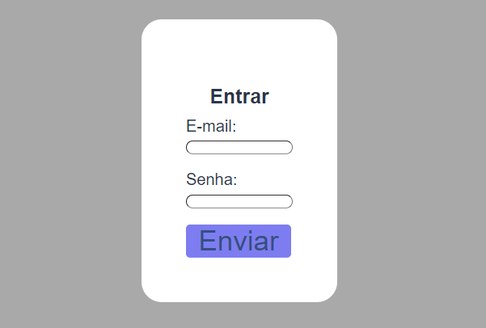

# Objetivo
 Criar um codigo de uma página de login usando CSS/bootstrap e HTML que contenha campos como email/nome de usuário e senha

 # Funcionalidades
  Esse projeto teria a função de encontrar e entrar na respectiva conta do site que foi colocada nos campos email/nome de usuário e senha.

# Método do HTML
 Reaproveitei um arquivo de formulário de contato, aonde possuia campos de nome, assunto e e-mail, foi tirado os respectivos arquivos: nome, assunto. E foi colocado um campo de senha.

 # Método do CSS
  No CSS deveria ser feito algo para deixar com um visual agradável na tabela com campos aonde deveria ser possível escrever email/nome de usuário e senha, então modifiquei a cor do fundo e do 'form' e depois ajustei o tamanho das fonte escritas dentro do 'form'.

 # Elementos utilizados
  Foram utilizados elementos como: 
* form
* input
* h1
* p
* button 
* span

 # Foto do projeto 
 

  # Autores
 Ricardo Siena
